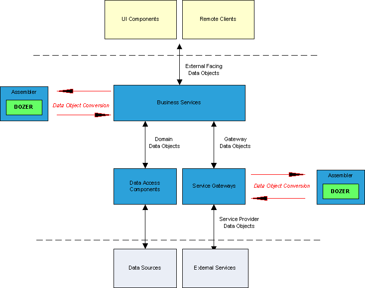

== What is Dozer?
Dozer is a Java Bean to Java Bean mapper that recursively copies data
from one object to another. Typically, these Java Beans will be of
different complex types.

Dozer supports simple property mapping, complex type mapping,
bi-directional mapping, implicit-explicit mapping, as well as recursive
mapping. This includes mapping collection attributes that also need
mapping at the element level.

Dozer not only supports mapping between attribute names, but also
automatically converting between types. Most conversion scenarios are
supported out of the box, but Dozer also allows you to specify custom
conversions via XML.

The mapper is used any time you need to take one type of Java Bean and
map it to another type of Java Bean. Most field mapping can be done
automatically by Dozer using reflection, but any custom mapping can be
predescribed in XML format. Mapping is bi-directional so only one
relationship between classes needs defining. If any property names on
both objects are the same you do not even need to do any explicit
property mapping for these fields.

The picture below depicts some of the common areas Dozer could be
inserted into an architecture. Notice that it typically is utilized at
the boundaries (entry/exit). Dozer will make sure that your internal
domain objects from the database do not bleed into external presentation
layers or to external consumers. It can also help map your domain
objects to external APIs calls and vice-versa.

The bean mapper is written in Java and relies heavily on the Jakarta
Commons Bean Utils package for Java Bean utility methods.

=== Why Map?
Please read the link:../documentation/whymap.adoc[Why Map?] page.

=== Frequently Asked Questions
Please read the link:../documentation/faq.adoc[FAQ] page.
