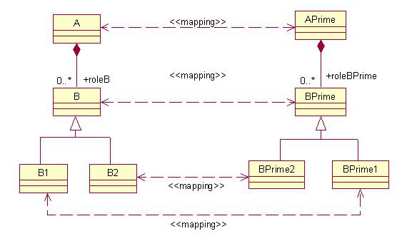

== Inheritance Mapping
=== Reducing Mapping XML when using base class attributes
*Properties that are of the same name do not need to be specified in the
mapping xml file unless hints are needed.*

If you are mapping subclasses that also have have base class attributes
requiring mapping XML, you might be inclined to reproduce base class
field maps in each subclass mapping element, like the following example:

[source,xml,prettyprint]
----
<mapping>
    <class-a>org.dozer.vo.SubClass</class-a>
    <class-b>org.dozer.vo.SubClassPrime</class-b>
    <field>
        <!-- this is the same for all sub classes -->
        <a>superAttribute</a>
        <b>superAttr</b>
    </field>
    <field>
        <a>attribute2</a>
        <b>attributePrime2</b>
    </field>
</mapping>
<mapping>
    <class-a>org.dozer.vo.SubClass2</class-a>
    <class-b>org.dozer.vo.SubClassPrime2</class-b>
    <field>
        <!-- this is the same for all sub classes -->
        <a>superAttribute</a>
        <b>superAttr</b>
    </field>
    <field>
        <a>attribute2</a>
        <b>attributePrime2</b>
    </field>
</mapping>
----

In the previous mapping, some of the fields were from a common base
class, but you had to reproduce them into each mapping of the sub
classes.

However, a better way to do it would be to map the base class
individually. This can be done for each base class (in the case of a
larger heirarchy). Assuming the base class name, below is the refactored
mapping xml:

[source,xml,prettyprint]
----
<mapping>
    <class-a>org.dozer.vo.SuperClass</class-a>
    <class-b>org.dozer.vo.SuperClassPrime</class-b>
    <field>
        <a>superAttribute</a>
        <b>superAttr</b>
    </field>
</mapping>
<mapping>
    <class-a>org.dozer.vo.SubClass</class-a>
    <class-b>org.dozer.vo.SubClassPrime</class-b>
    <field>
        <a>attribute</a>
        <b>attributePrime</b>
    </field>
</mapping>
<mapping>
    <class-a>org.dozer.vo.SubClass2</class-a>
    <class-b>org.dozer.vo.SubClassPrime2</class-b>
    <field>
        <a>attribute2</a>
        <b>attributePrime2</b>
    </field>
</mapping>
----

The following images explain some of the different scenarios dozer
handles. Each diagram shows two mapped class hierarchies and existing
relations, which Dozer recognizes and maps.

image:../images/scenario1.jpg[scenario1]

Scenario 1 shows that if you map SubClass to ClassPrime all attributes
from SuperClass -> ClassPrime will be mapped as well.

image:../images/scenario2.jpg[scenario2]

Scenario 2 shows that Dozer has no limitations on the inheritance depth
it analyzes to find parent mappings.

Scenario 3 shows that it is possible to map two collections with
different subctypes of the same parent type. This is done by providing
hints to the collection mapping, describing all potential subclasses.

[source,xml,prettyprint]
----
<field>
    <a>aList</a>
    <b>bList</b>
    <a-hint>B1,B2</a-hint>
    <b-hint>BPrime1,BPrime2</b-hint>
</field>
----
