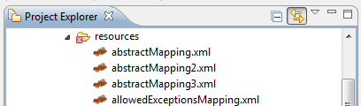

== Prerequisites
The Plugin currently depends on

* link:http://www.eclipse.org/webtools/[WTP 3.0.2 or latest]

=== Compatibility
Plugin is supported and been tested on the following IDEs

* link:http://www.eclipse.org[Eclipse 3.6]
* link:http://www.ibm.com/developerworks/rational/library/10/whats-new-in-rational-software-architect-8/[RAD
RSA 8.0.1]

=== Installation
The Dozer Plugin-feature can be installed and updated using the Eclipse
Update Manager.

* Add a new Update-URL:
+
[source,prettyprint]
----
http://dozer.sourceforge.net/eclipse-plugin
----

Select all required dependencies and install the plugin.

Alternatively you can download the package at
https://sourceforge.net/project/showfiles.php?group_id=133517[sourceforge]
and unzip it in your eclipse installation folder. You might have to
enable the Plugin after starting Eclipse. This can be done at Help >
Software Updates > Manage Configuration.

After installation is done you should see a little red dozer-icon on all
your mapping-xml files. +

