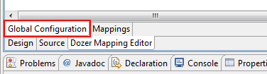
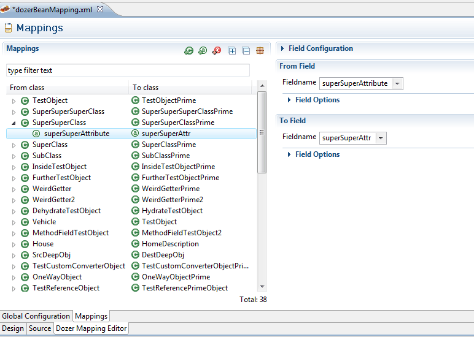

== Setting global dozer configuration
All global configuration values can be set in the "Global Configuration"
Tab.

=== Configuring mappings
Every classmapping is listed in the "Mapping" Tab. Mappings of classes
and fields can be added by Popup menu or the action-buttons at the top.
On the right side the mappings can be configured. Every Attribute or
Element in the XML file is shown for editing. +

