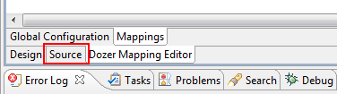
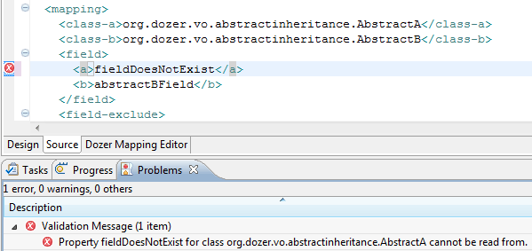

== Open mapping file
When opening a Dozer-mapping-file the Dozer-editor appears. If you want
to edit the raw XML you can switch to the "source" view. +

=== Content Assist
All the class-a/class-b, field, get-method, set-method, etc -nodes or
-attributes automaticly show content-assist popups when pressing
ctrl+space or the configured WTP-XML content assist characters. These
can be changed in the preferences. +
image:../../images/eclipse-xmlassist.gif[image] +
image:../../images/eclipse-xmlassist2.gif[image]

=== Validation
The Dozer Plugin validates the Mapping to find out if the mapped class
do exist and if the mapped fields are accessible. +

