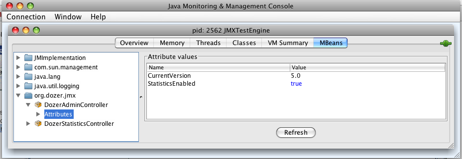

== JMX Integration
Dozer can be managed via JMX. The Dozer distibution contains fully
functional JMX MBeans. These MBeans can be found in the org.dozer.jmx
package.

Dozer auto registers these JMX Beans with the PlatformMBeanServer. You
can suppress this behavior with the following Dozer configuration
property:

dozer.autoregister.jmx.beans = false

[cols="2*", options="header"]
.Dozer JMX MBeans
|===
|MBean
|Description

|DozerStatisticsControllerMBean
|Runtime mapping statistics. The link:./configuration/statistics.adoc[Statistics] section contains more information on the types of statistics that are available.

|DozerAdminControllerMBean
|Admin functions such as enabling/disabling statistics gathering at runtime.
|===

Note that JMX MBeans are potential source of memory leaks. MBeans should
be disposed properly when application is stopped or restarted as in most
of todays Web Containers there is no full JVM restart. The proper way to
unregister all Dozer JMX Beans is to call destroy() method on
DozerBeanMapper object.

=== Sample JMX Screen Shots
Dozer JMX MBeans via JConsole.....

image:../images/jmx1.png[jmx1]

